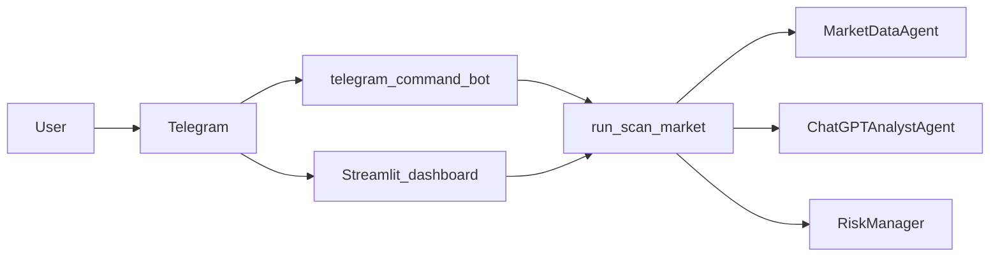

# «Texnik xulosa.pdf» ↔ `us-stock-rvol-agents` gap-matrix

Manba PDF: Uzbek tilidagi texnik xulosa (~12 sahifa), komponentlari va rivojlantirish jadvali.

| Bo‘lim (xulosa) | Rejada kutilgan | Loyihada hozir | Holat |
|----------------|-----------------|----------------|-------|
| Arxitektura: serverless/VPS/container | Qo‘lda tanlanadigan opsiyalar tasvirlangan | **Render Blueprint**: `render.yaml` orqali **Web** + **Worker** (Python starter), Docker konteyner asosida ish | Qisman uyg‘un (serverless emas; PaaS) |
| Telegram: webhook va long polling | Ikki rejim tasvirlangan; prod uchun webhook ustun deb ko‘rinadi | **Long-polling** [`scripts/telegram_command_bot.py`](../scripts/telegram_command_bot.py); webhook o‘rniga polling; `deleteWebhook` startda | Ishlaydi — webhook yo‘nalishi yo‘q |
| ChatGPT / OpenAI | Prompt, token tejash, limit/429, streaming | Structured JSON rejimidagi **tahlil** [`agents/chatgpt_analyst_agent.py`](../agents/chatgpt_analyst_agent.py) + retry/backoff rejasi (amalda) | Qisman uyg‘un; streaming kodda asosiy kerak bo‘lsa keyin |
| Ma’lumot provayderlari jadvalida | Alpha Vantage, Finnhub, EODHD + UZ/Ziyo eslatması | Finnhub (+ quote), Polygon, Alpaca, Yahoo (**yfinance**), ixtiyoriy **Alpha Vantage** kunlik tugun | Finnhub+EOD uygun; Alpha Vantage ixtiyoriy qo‘shildi |
| Skrinner dizayni: indikatorlar | RSI, SMA/EMA, ADX va h.k. | [`agents/indicators.py`](../agents/indicators.py) — VWAP, RSI, EMA, ATR va strategiya modullari | Uyg‘un |
| Foydalanuvchi DSL qoidalari | Matndagi qoidalar konfig | `.env` va strategiya rejimlari (`STRATEGY_MODE`) | Qisman — keng DSL yo‘q |
| Backtesting | Backtrader/vectorbt va h.k. | **MVP**: [`agents/simple_backtest_mvp.py`](../agents/simple_backtest_mvp.py), CLI [`scripts/simple_backtest.py`](../scripts/simple_backtest.py), Telegram `/backtest [TICKER]` | MVP qo‘shildi; chuqur backtest keyin |
| Cron / navbat / WebSocket | Har kuni skan, navbatlar | Skan **foydalanuvchi** yoki `/scan` / dashboard orqali; cron Renderda alohida sozlanadi | Rejada kengaytirish |
| Multi-API orkestratsiya | Modullar bo‘yicha ajratish | `scan_pipeline`, `MarketDataAgent`, alert agentlar | Uyg‘un |
| Xavfsizlik: kalitlar | .env / secrets | `.env`, `render.yaml` `sync: false`, `TELEGRAM_ALLOWED_CHAT_IDS` | Uyg‘un |
| Rate limiting (bot / API) | Ichki limitlar | LLM uchun qayta urinish; botda chat-bo‘yicha limit keyin | Qisman |
| Monitoring / xarajat | Grafana, Sentry, taxminiy narx | Render loglar; `scripts/check_apis.py` | Qisman |

## Ma’lumot oqimi (xulosa diagrammasi bilan solishtirish)

Xulosa: `Foydalanuvchi → Telegram → Webhook → Server → (ChatGPT, Bozor, Broker) → DB → javob`.

Loyiha (asosiy oqim):

## Xulosa bo‘yicha keyingi katta bo‘shliqlar

1. **Webhook** endpoint (HTTPS domen) production varianti.
2. **Foydalanuvchi yozma qoidalar DSL** (masalan, `SMA20 > SMA50` parser).
3. **Chuqur backtest** va strategiya optimizatsiyasi (vectorbt/Backtrader integratsiyasi).
4. **Navbat / WebSocket** real-vaqt trafik uchun.
5. **Bot-level rate limit** (spam va double `/scan` qarshi).

Bu jadval PR va prioritetlarni tanlash uchun ishlatiladi; batafsil backlog: [`PRIORITY_BACKLOG.md`](PRIORITY_BACKLOG.md).
